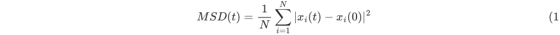

# Microscope-Prototype

Prototype Tests for Extraction of trajectories and calculation of avg. speed histograms: [here.](https://github.com/yatharthb97/SwimTracker/blob/main/Trajectory-Extraction-Tests.ipynb)

## Introduction

This repository contains instructions and basic prototype scripts for controlling our in-house low cost microscope, and the analysis of data acquired from it.

+ [Installation of required libraries](install_libraries.ipynb)
+ [Camera controls]( camera_controls.ipynb)
+ [Videos to trajectories](video_to_trajectories.ipynb)
+ [Analysis of trajectories](analysis_of_trajectories.ipynb)

### Creating Trajectories

```mermaid
flowchart TD
	CC("Create & Init Camera 📷") --> CV(Capture Video)
	CV --> EX("Extract Frames <br> to Array")
	EX --> Frames[("Frames (list of RGB arrays)")]
	Frames --For-each--> LF(Locate-Features)
	LF --> LST[(List of Features per frame)]
	LST --"<b>Link Features</b>"--> TRJ[(Trajectories)]

```

### From Trajectories to Statistics

#### Average Speed Histogram

### Mean Squared Displacement (MSD)

Mean Squared Displacement for an ensamble of $N$ particles (swimmers):

$$
MSD(t) = \frac {1}{N} \sum_{i=1}^{N} | x_i(t) - x_i(0) |^2
$$

For n-dimesnions, we have:

$$
MSD = 2nDt
$$

